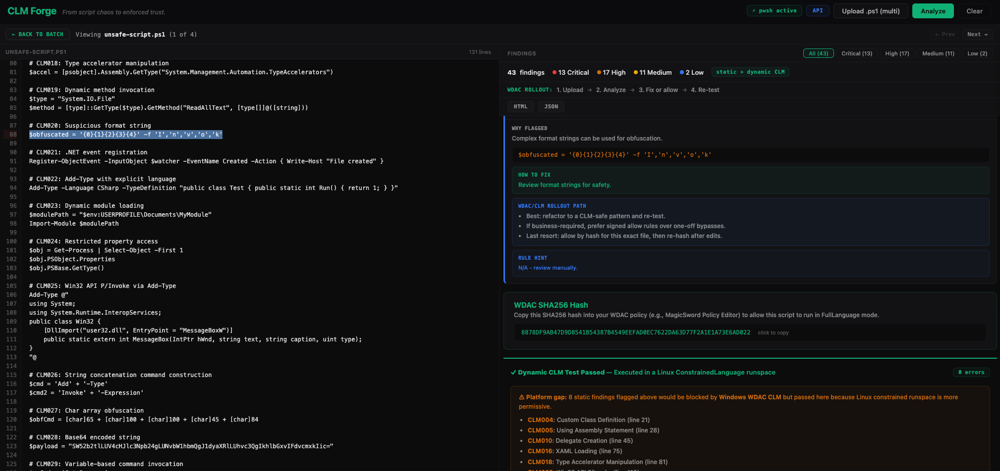

# CLM Forge

**From script chaos to enforced trust.**

CLM Forge is a PowerShell script-enforcement readiness toolkit for teams moving to **WDAC Script Enforcement** and **Constrained Language Mode (CLM)**.



It helps you answer, fast:
- What scripts will break?
- Why will they break?
- How do we fix them?
- If we cannot fix immediately, what is the safest allow path?

## Mission

Enable a practical zero-to-hero rollout path for script enforcement across a fleet:

1. Upload or point at scripts.
2. Analyze static CLM/WDAC risk.
3. Validate dynamically in a constrained runspace (when `pwsh` is available).
4. Fix scripts where possible.
5. Use signer/path/hash allow decisions intentionally where needed.
6. Re-test and export evidence (HTML/JSON/CSV/SARIF) for rollout gates.

## What You Get Per Finding

Each finding is designed to be actionable for enforcement rollout:
- **Rule + severity**: what policy boundary was crossed.
- **Why flagged**: what pattern/construct triggered detection.
- **How to fix**: safer CLM-compatible remediation guidance.
- **WDAC/CLM rollout path**: practical options (refactor, signed allow, hash allow).

## Components

### 1) Web UI + API (`web/`)
Use this for fast triage, batch audits, and CI exports.

- Static analysis (31 rules)
- Dynamic constrained runspace execution (when `pwsh` is present)
- WDAC SHA256 hash output for allow-by-hash workflows
- Batch portfolio scoring + CI fail thresholds
- HTML / JSON / CSV / SARIF exports

### 2) PowerShell Module (`CLM-Forge/`)
Use this on Windows for deeper policy/environment signals.

- AST/static checks with remediation
- WDAC trust checks (`WldpCanExecuteFile` flow)
- Policy/environment introspection
- Report generation (console/html/json/log)

## Quick Start

### Web UI (local)

```bash
cd web
pip install -r requirements.txt
uvicorn app:app --host 0.0.0.0 --port 8080
```

Open `http://localhost:8080`.

### Docker

```bash
cd web
docker compose up --build
```

For a plain image build from source, run from the repository root so the web
app and PowerShell module are included in the image:

```bash
docker build -f web/Dockerfile -t clm-forge .
```

The image pins PowerShell through the `POWERSHELL_VERSION` Docker build arg.
Override only when intentionally testing a different runtime:

```bash
docker build -f web/Dockerfile --build-arg POWERSHELL_VERSION=7.6.1 -t clm-forge .
```

Web API smoke test after installing `web/requirements.txt`:

```bash
cd web
python tests/smoke_api.py
```

Full production verifier from the repository root:

```bash
scripts/verify-production.sh
```

On machines without Docker or local PowerShell runtimes, run the checks that
can be verified in that environment:

```bash
scripts/verify-production.sh --skip-docker --skip-powershell
```

Or pull from GHCR:

```bash
docker pull ghcr.io/magicsword-io/clm-forge:latest
docker run -p 8080:8080 ghcr.io/magicsword-io/clm-forge:latest
```

### PowerShell Module (Windows)

```powershell
Import-Module .\CLM-Forge\CLM-Forge.psd1

# Full orchestrated run
Invoke-CLMForge -ScriptPath .\MyScript.ps1 -OutputFormat All

# Targeted static compatibility check
Test-ScriptCLMCompatibility -ScriptPath .\Deploy.ps1

# Ask WDAC trust path directly
Test-ScriptWDACTrust -ScriptPath .\Deploy.ps1
```

`Test-ScriptWDACTrust` uses Windows WLDP APIs for policy answers. On Windows 11
build 22621+ it calls `WldpCanExecuteFile` for `Allowed`, `Blocked`, or
`ConstrainedLanguage` results. On older Windows builds it falls back to
`WldpGetLockdownPolicy` per-file evaluation, which can distinguish trusted
FullLanguage from CLM but cannot report the newer hard-block verdict.

Compatibility smoke tests for Windows PowerShell 5.1 and PowerShell 7:

```powershell
powershell.exe -NoProfile -ExecutionPolicy Bypass -File .\tests\run-compatibility.ps1
pwsh -NoProfile -File .\tests\run-compatibility.ps1
```

## Capability Matrix

| Capability | PowerShell Module (Windows) | Web UI / Container |
|---|:---:|:---:|
| Static analysis (31 rules) | Yes | Yes |
| Dynamic CLM test (constrained runspace) | Yes | Yes (via `pwsh`) |
| WDAC hash output | Yes | Yes |
| WinAPI/WDAC policy introspection | Yes | No (Windows-only) |
| COM/type host checks | Yes | Limited |
| Event log analysis | Yes | No |
| SARIF/CSV export | Yes (via report flows) | Yes |

## Scoring Model

Per-script score is intentionally simple and punitive toward high-risk constructs:

`score = max(0, 100 - deductions)`

Deductions:
- Critical: 15
- High: 8
- Medium: 3
- Low: 1

This is a rollout-prioritization signal, not a replacement for engineering review.

## Typical Rollout Playbook

1. Run batch analysis on your script estate.
2. Sort by score/severity and start with highest-risk scripts.
3. Refactor CLM-incompatible patterns first.
4. For unavoidable exceptions, prefer signed allow rules.
5. Use hash allow only when change churn is low and controlled.
6. Enforce CI fail thresholds (`fail_on`) before production rollout.

## API Highlights

- `POST /api/analyze-text` — analyze pasted script
- `POST /api/analyze` — analyze uploaded file
- `POST /api/analyze-batch` — analyze many scripts
- `POST /api/analyze-batch-upload` — multipart batch upload
- `POST /api/report/html` — single-script HTML report
- `POST /api/report/html-batch` — portfolio HTML report
- `POST /api/export/sarif` — SARIF 2.1.0
- `POST /api/export/csv` — flat finding export
- `GET /api/rules` — rule catalog

## Requirements

- PowerShell module flows: Windows PowerShell 5.1+ / PowerShell 7+
- Web UI/API: Python 3.10+
- Dynamic runspace checks: `pwsh` on PATH
- Docker: supported for quick start

## License

Apache License 2.0
